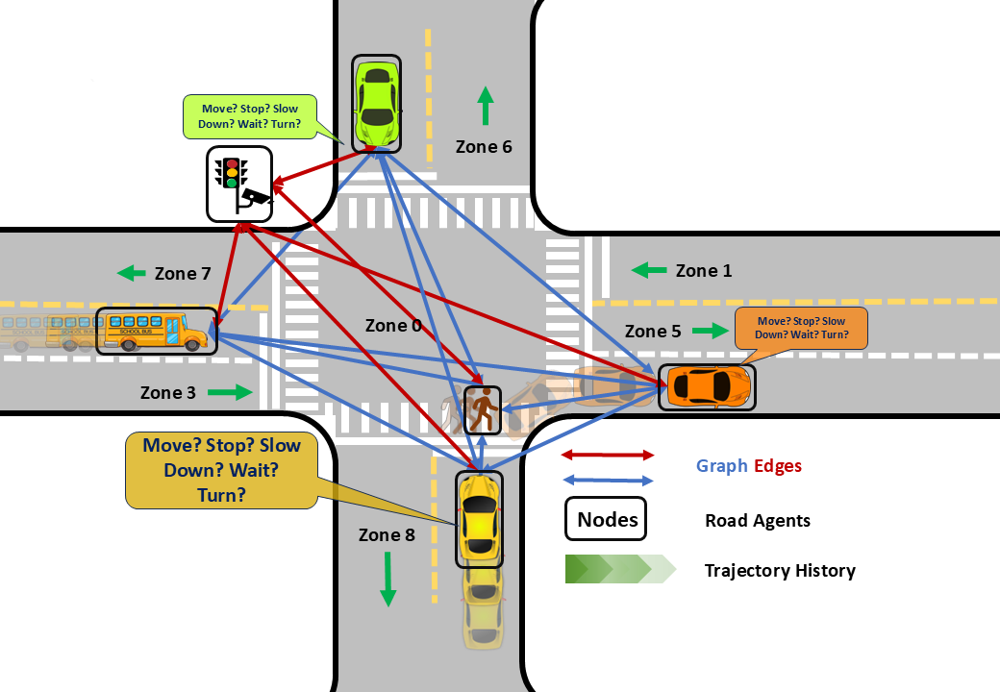

<p align="center"></p>

# HDAAGT #
<div style="text-align: justify;">
Heterogeneous Decision-Aware Attention Graph Transformer for Scene-Centric Trajectory Predicton (HDAAGT): A non-autoregressive, encoder-only transformer model for vehicle trajectory prediction. HDAAGT integrates lane positioning, traffic light states, and vehicle kinematics, enabling a decision-aware graph attention mechanism that models agent-agent and agent-environment interactions. Decision-Aware Attention Graph(DAAG) network models the spatiotemporal influence of all neighboring road agents with and generates the decisions token for all road agents simultaneously.
</div>
</br>

<p align="center"></p>

## Installation
Clone this repository with the following command:
```
git clone https://github.com/abdibehzad96/HDAAGT-SinD.git
```


## SinD dataset

For getting access and download the SinD dataset, please refer to the SinD github page shown in below and place the file in the `data/` directory:

```
https://github.com/SOTIF-AVLab/SinD.git
```
Then check if the `detection_path`and the `lightpath` comply with the SinD files.


## Environment Setup

First, we'll create a conda environment to hold the dependencies

```
conda create --name hdaagt python=3.10 -y
source activate hdaagt
conda install --yes --file ./configs/requirements.txt
```

## Model Configuration
In the [configs/config.yaml](./configs/config.yaml) directory, you will find all the necessary parameters to train or test the model. Below is a breakdown of some key parameters to help you get started:

* **detection_path**: Specifies the path to the Fisheye-MARC CSV file.
* **generate_data**: [Bool] When set to `true`, prepares the Fisheye-MARC data for training/testing.
* **Zoneconf_path**: Path to the `ZoneConf.yaml` file used for dataset generation.

* **Load_Model**: [Bool] When set to `true`, loads a previously saved model.
* **Load_Model_Path**: Path to the previously saved model.
* **Train**: [Bool] When set to `true`, initiates training with the prepared data.
* **Test**: [Bool] When set to `true`, runs tests on the model using the prepared data.
* **Test_during_training**: [Bool] When set to `true`, tests the model every 5 epochs during training.
* **verbal**: [Bool] When set to `true`, prints the configuration parameters to the console.


## Model Training/Testing

After configuring the settings in the configuration file, you can run the model either by executing the `main.py` file directly or by running the following command in the terminal:

```
python main.py --config <path to config.yaml>
```
For both training and testing, the **Train** and **Test** values in the configuration file must be set. If both are enabled, testing will be performed at the end of the training session. Additionally, you can evaluate the model's performance on the test data during training by setting **Test_during_training** to `true`.

## Model Output
The expected output dimension of the model is **[B, SL, N, xy]**, where:  

- **B**: Batch size.  
- **SL**: Sequence length.  
- **N**: Number of agents on the road (up to `Nusers`).  
- **xy**: Predicted x and y coordinates. 

The image below illustrates the historical trajectories of road agents (represented as lines), along with their actual final positions (shown as circles) and predicted final positions (depicted as rectangles) after 3 seconds.
<p align="center"></p>

The best-trained model can be found in the [Pickled/best_trained_model.pth](./Pickled/best_trained_model.pth) directory.


## Dataset Preperation/Input Embedding

The code allows you to select specific columns for preprocessing and embedding. The `Columns_to_keep` parameter, defined as an array of column index numbers in the configuration file, determines which columns are used.  

Additionally, you must specify which indices within `Columns_to_keep` correspond to **Positional Embedding** using `xy_indx` and which ones correspond to **Traffic Embedding** using `Traffic_indx`.  

The following parameters configure the embedding layers:  

- **trf_embedding_dict_size**: Embedding dictionary size for `Traffic_indx`.  
- **trf_embedding_dim**: Embedding dimension for `Traffic_indx`.  
- **pos_embedding_dict_size**: Embedding dictionary size for `xy_indx`.  
- **pos_embedding_dim**: Embedding dimension for `xy_indx`.

